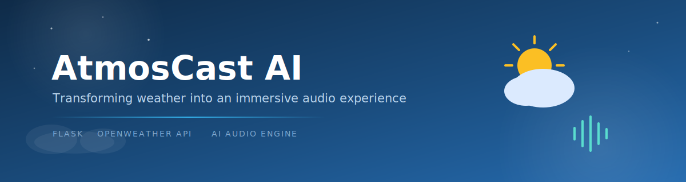
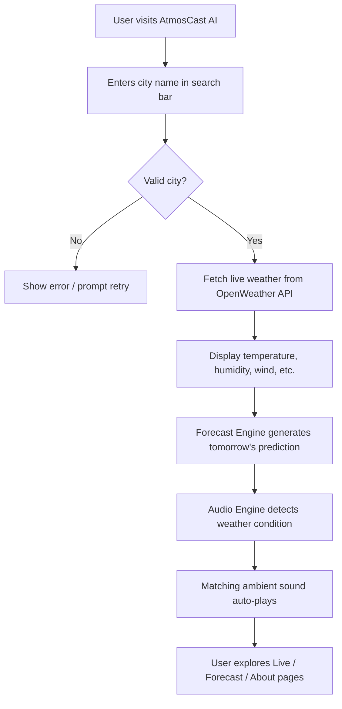
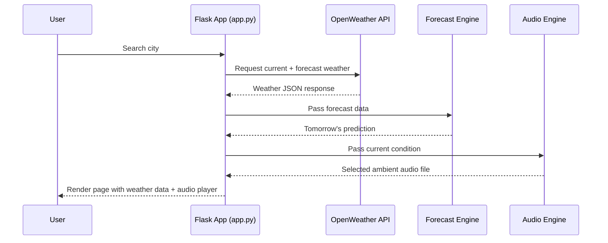
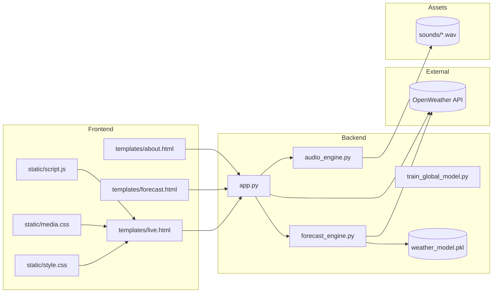

<div align="center">

# 🌦️ AtmosCast AI

### *Transforming Weather into an Immersive Audio Experience*

An AI-powered weather web app that doesn't just show you the weather — it lets you **hear** it.

<!-- Banner Placeholder -->
<!--  -->
`[ file:///C:/Users/pawan/Desktop/project_banner.jpeg]`

[](https://www.python.org/)
[](https://flask.palletsprojects.com/)
[](https://developer.mozilla.org/en-US/docs/Web/HTML)
[](https://developer.mozilla.org/en-US/docs/Web/CSS)
[](https://developer.mozilla.org/en-US/docs/Web/JavaScript)
[](https://openweathermap.org/api)
[](https://render.com)

[🌐 Live Demo](https://atmoscast-ai-30dq.onrender.com/) · [📦 Source Code](https://github.com/Jayita-pro/AtmosCast_AI) · [🐞 Report Bug](https://github.com/Jayita-pro/AtmosCast_AI/issues) · [✨ Request Feature](https://github.com/Jayita-pro/AtmosCast_AI/issues)

</div>

---

## 📋 Table of Contents

1. [About the Project](#-about-the-project)
2. [Problem Statement](#-problem-statement)
3. [Solution](#-solution)
4. [Key Features](#-key-features)
5. [Screenshots](#-screenshots)
6. [Demo](#-demo)
7. [System Architecture](#-system-architecture)
8. [Folder Structure](#-folder-structure)
9. [Installation](#-installation)
10. [Environment Variables](#-environment-variables)
11. [Usage Guide](#-usage-guide)
12. [API Information](#-api-information)
13. [Audio Generation Engine](#-audio-generation-engine)
14. [Future Improvements](#-future-improvements)
15. [Performance Optimizations](#-performance-optimizations)
16. [Security Measures](#-security-measures)
17. [Challenges Faced](#-challenges-faced)
18. [Learning Outcomes](#-learning-outcomes)
19. [Contributing](#-contributing)
20. [Author](#-author)
21. [Acknowledgements](#-acknowledgements)
22. [Contact](#-contact)

---

## 🧭 About the Project

**AtmosCast AI** is an AI-powered weather forecasting web application that goes beyond the traditional "temperature and icon" format. It combines **real-time weather data** with an **intelligent ambient sound synthesis engine**, generating an environmental soundscape that matches the current weather condition of any city in the world — in real time.

Instead of just reading that it's raining, you hear the rain. Instead of just seeing "clear skies," you hear birds and a gentle breeze. The result is a **multisensory weather experience** that is more intuitive, more immersive, and simply more enjoyable to use than a standard weather dashboard.

> 💡 **Note:** This is a solo-built, end-to-end project — covering backend engineering, third-party API integration, a custom forecasting model, and a custom audio engine, all designed and implemented by one developer.

---

## ❓ Problem Statement

Most weather applications present information in a purely **visual and numeric** format — temperature, humidity, wind speed, and icons. This works, but it:

- Feels clinical and disconnected from how weather actually *feels*.
- Requires users to mentally translate numbers into an actual sense of the environment.
- Offers no emotional or sensory engagement — every weather app looks and feels the same.

There was a clear gap for an application that makes weather data feel **alive and immersive**, rather than just informative.

---

## ✅ Solution

AtmosCast AI solves this by pairing live weather data with a **condition-aware ambient audio layer**:

1. The user searches for a city.
2. The app fetches real-time weather data and a next-day forecast via the OpenWeather API.
3. The detected weather condition (clear, rain, thunderstorm, wind, fog, etc.) is passed to a **custom Audio Engine**.
4. The engine automatically selects and plays a matching ambient soundtrack — no manual selection required.
5. The UI itself adapts visually to reflect the mood of the current weather.

The result: users don't just check the weather — they **experience** it.

---

## ⭐ Key Features

### 🌍 Real-Time Weather Search
Users can type in any city name globally and instantly retrieve live weather conditions, powered by the OpenWeather API.

### 🌐 Global City Search
The search is not limited to a fixed list — any valid city name recognized by OpenWeather can be queried, making the app usable worldwide.

### 📊 Live Weather Data
On every search, the app displays a full weather profile: current temperature, "feels like" temperature, humidity, atmospheric pressure, wind speed, visibility, cloud condition, and sunrise/sunset times.

### 📅 Tomorrow's Weather Prediction
Beyond current conditions, the **Forecast Engine** (`forecast_engine.py`) processes forecast data — supplemented by a trained model (`weather_model.pkl`) — to project tomorrow's expected temperature, humidity, wind, and condition.

### 🎧 AI-Based Ambient Sound Synthesis
This is the core differentiator. The **Audio Engine** (`audio_engine.py`) maps the detected weather condition to a curated ambient track:

| Weather Condition | Ambient Sound |
|---|---|
| ☀️ Clear / Sunny | Birds chirping, gentle breeze |
| 🌦️ Light Rain | Soft rainfall ambience |
| 🌧️ Heavy Rain | Heavy rainfall ambience |
| ⛈️ Thunderstorm | Thunder + heavy rain |
| ❄️ Cold / Snow | Calm winter wind ambience |
| 🌫️ Fog | Soft atmospheric tones |
| 💨 Windy | Flowing wind sounds |
| 🌲 Mild / Spring-like | Spring forest ambience |
| 🦗 Warm evenings | Insects & crickets ambience |

### ▶️ Automatic Audio Playback
There is no manual "pick a sound" step — the correct ambient track is selected and queued automatically the moment weather data is retrieved, with an embedded player for play/pause, seek, and volume control.

### 🎨 Dynamic User Interface
The interface's background gradient and visual tone shift based on both the weather condition and time of day (day / evening / night), reinforcing the multisensory experience visually as well as aurally.

### 📱 Responsive Design
The layout is fully responsive, adapting cleanly from desktop widescreen views down to mobile viewports.

### 🔐 Secure API Key Management
The OpenWeather API key and other secrets are never hardcoded — they are loaded from environment variables, keeping credentials out of source control.

### 🧩 Modular Project Architecture
The codebase is cleanly separated by responsibility:
- `app.py` — Flask routes & app entry point
- `forecast_engine.py` — forecast logic & model inference
- `audio_engine.py` — weather-to-sound mapping & playback logic
- `train_global_model.py` — training script for the forecast model
- `templates/` — Jinja2 HTML views
- `static/` — CSS & JS assets
- `sounds/` — ambient audio library

### 🗂️ Automatic Audio File Management
The audio engine manages selection and serving of the correct `.wav` file for the current condition efficiently, avoiding redundant loads or orphaned temporary files.

### ⚡ Fast Weather Retrieval
Weather requests are lightweight and optimized for quick round-trip response times, so users get data (and sound) with minimal delay.

### 🖱️ Interactive User Experience
From live weather stats to the audio player controls and the forecast comparison view, every part of the UI is designed to be explored and interacted with, not just read.

---

## 🖼️ Screenshots

> Replace the placeholders below with actual screenshots stored in an `/assets` or `/docs/screenshots` folder.

| View | Preview |
|---|---|
| 🏠 Home Page | `[ Screenshot Placeholder: home-page.png ]` |
| 🌤️ Weather Results | `[ Screenshot Placeholder: weather-results.png ]` |
| 🎧 Audio Player | `[ Screenshot Placeholder: audio-player.png ]` |
| 📅 Tomorrow Forecast | `[ Screenshot Placeholder: forecast-view.png ]` |
| 📱 Mobile View | `[ Screenshot Placeholder: mobile-view.png ]` |

---

## 🎬 Demo

- 🌐 **Live Demo:** [https://atmoscast-ai-30dq.onrender.com/](https://atmoscast-ai-30dq.onrender.com/)
- 🎥 **Video Demo:** `[ Video Demo Placeholder — add YouTube/Loom link ]`
- 🖼️ **GIF Preview:** `[ GIF Preview Placeholder — add ./assets/demo.gif ]`

---

## 🏗️ System Architecture

### User Flow Diagram



### Application Workflow



### Module Architecture



---

## 📁 Folder Structure

```
AtmosCast_AI/
├── sounds/
│   ├── birds_chirping.wav
│   ├── cold_wind.wav
│   ├── heavy_rain.wav
│   ├── insects_crickets.wav
│   ├── light_rain.wav
│   ├── spring_forest.wav
│   ├── thunderstorm.wav
│   └── wind_blowing.wav
├── static/
│   ├── media.css
│   ├── script.js
│   └── style.css
├── templates/
│   ├── about.html
│   ├── base.html
│   ├── forecast.html
│   └── live.html
├── .gitignore
├── app.py                  # Flask app entry point & routes
├── audio_engine.py         # Weather → ambient sound mapping & playback
├── forecast_engine.py      # Tomorrow's forecast logic
├── train_global_model.py   # Script to train the forecasting model
├── weather_model.pkl       # Pre-trained forecasting model
├── requirements.txt
└── README.md
```

---

## ⚙️ Installation

### 1️⃣ Clone the repository
```bash
git clone https://github.com/Jayita-pro/AtmosCast_AI.git
cd AtmosCast_AI
```

### 2️⃣ Create a virtual environment
```bash
python -m venv venv
source venv/bin/activate      # On Windows: venv\Scripts\activate
```

### 3️⃣ Install dependencies
```bash
pip install -r requirements.txt
```

### 4️⃣ Configure environment variables
Create a `.env` file in the project root (see [Environment Variables](#-environment-variables) below).

### 5️⃣ Run the Flask application
```bash
flask run
```
or
```bash
python app.py
```

The app will be running at `http://127.0.0.1:5000`.

> 💡 **Tip:** Make sure your OpenWeather API key is active — new keys can take a few minutes to activate after creation.

---

## 🔑 Environment Variables

Create a `.env` file in the root directory with the following:

```env
# OpenWeather API key (required)
OPENWEATHER_API_KEY=your_openweathermap_api_key_here

# Flask configuration
FLASK_APP=app.py
FLASK_ENV=development
SECRET_KEY=your_secret_key_here
```

| Variable | Description | Required |
|---|---|---|
| `OPENWEATHER_API_KEY` | API key used to fetch live & forecast weather data | ✅ |
| `SECRET_KEY` | Flask secret key for session security | ✅ |
| `FLASK_ENV` | `development` or `production` | ⚪ Optional |

> ⚠️ **Warning:** Never commit your `.env` file. It should always be listed in `.gitignore`.

---

## 📖 Usage Guide

1. **Open the app** — visit the [live demo](https://atmoscast-ai-30dq.onrender.com/) or run it locally.
2. **Search a city** — type a city name into the search bar in the navbar and hit search.
3. **View live conditions** — temperature, feels-like, humidity, wind, pressure, visibility, sunrise/sunset all populate instantly.
4. **Listen to the ambience** — the matching ambient soundtrack begins automatically; use the built-in player to pause, seek, or adjust volume.
5. **Check tomorrow's forecast** — switch to the **Forecast** tab to see a side-by-side comparison of today vs. tomorrow's predicted temperature, humidity, wind, and expected condition.
6. **Learn more** — visit the **About** page for project background and details.

---

## 🔌 API Information

AtmosCast AI integrates with the **[OpenWeather API](https://openweathermap.org/api)** for both current conditions and forecast data.

**Typical endpoints used:**

| Endpoint | Purpose |
|---|---|
| `/data/2.5/weather` | Fetches current live weather for a given city |
| `/data/2.5/forecast` | Fetches multi-interval forecast data used to derive tomorrow's prediction |

**Data flow:**

1. User's city query is sent from the frontend search form to the Flask backend (`app.py`).
2. Flask calls the OpenWeather API with the query and the securely stored API key.
3. The JSON response is parsed for temperature, condition, humidity, wind, pressure, visibility, and sunrise/sunset timestamps.
4. Forecast data is passed to `forecast_engine.py`, which — combined with the trained model (`weather_model.pkl`) — derives tomorrow's expected values.
5. Parsed data is rendered into the Jinja2 templates (`live.html`, `forecast.html`).

---

## 🔊 Audio Generation Engine

The **Audio Engine** (`audio_engine.py`) is what makes AtmosCast AI unique. Here's how it works:

1. Once the current weather condition is retrieved (e.g., "Clear," "Rain," "Thunderstorm," "Mist"), the condition string is normalized and classified into one of the app's supported categories.
2. Each category is mapped to a specific pre-recorded ambient `.wav` file stored in the `sounds/` directory (e.g., `thunderstorm.wav`, `insects_crickets.wav`).
3. Secondary signals — like time of day or temperature — can refine the choice (e.g., distinguishing `cold_wind.wav` from `wind_blowing.wav`, or `insects_crickets.wav` for warm evenings vs. `spring_forest.wav` for mild daytime conditions).
4. The selected file path is passed to the frontend, where an HTML5 `<audio>` element auto-loads and plays it, with standard playback controls exposed to the user.

> This condition → sound mapping keeps the experience deterministic and fast, while still feeling responsive and "alive" to changing weather.

---

## 🚀 Future Improvements

- 🎼 AI-generated **adaptive/generative soundscapes** (instead of fixed pre-recorded clips)
- 📆 **Multi-day forecasting** (beyond just tomorrow)
- 📈 **Weather history** tracking and trend charts
- 👤 **User accounts** with saved preferences
- ⭐ **Favorite cities** for quick access
- 🗺️ **Interactive weather maps**
- 🍂 **Seasonal sound themes**
- 📴 **Offline mode**
- 📲 **Progressive Web App (PWA)** support
- 🌗 **Dark/Light mode** toggle
- 🎙️ **Voice-controlled search**
- 🤖 **AI-driven recommendations** (e.g., "good day for a walk")

---

## ⚡ Performance Optimizations

- Lightweight, minimal-dependency Flask backend for fast response times.
- Pre-recorded audio assets (rather than real-time audio synthesis) keep playback latency low.
- Efficient parsing of only the required fields from OpenWeather API responses.
- Static assets (CSS/JS) served directly via Flask's static file handling.

---

## 🔒 Security Measures

- API keys and secrets are managed via environment variables, never committed to source control.
- `.gitignore` configured to exclude `.env`, virtual environments, and cache files.
- Input from the city search field is validated before being passed to the external API.

---

## 🧗 Challenges Faced

- Reliably mapping a wide variety of raw weather condition strings from the API into a clean, limited set of ambient sound categories.
- Designing a UI that visually reflects both **weather condition** and **time of day** without becoming overly complex.
- Building and validating a forecasting model (`train_global_model.py` / `weather_model.pkl`) that complements live API forecast data rather than conflicting with it.
- Ensuring smooth, uninterrupted audio playback synced with page/data updates.

---

## 📚 Learning Outcomes

- Practical experience integrating a third-party REST API (OpenWeather) into a Flask application.
- Hands-on experience designing a modular backend architecture (separating forecasting, audio, and routing concerns).
- Experience building and deploying a trained ML model alongside a live web application.
- Strengthened skills in translating a UX/product idea ("hear the weather") into a working technical implementation.
- Deployment experience with Render, including environment variable management in production.

---

## 🤝 Contributing

Contributions, issues, and feature requests are welcome!

1. Fork the repository
2. Create your feature branch: `git checkout -b feature/AmazingFeature`
3. Commit your changes: `git commit -m 'Add some AmazingFeature'`
4. Push to the branch: `git push origin feature/AmazingFeature`
5. Open a Pull Request

---

## 👤 Author

**AtmosCast AI** is designed, developed, and maintained by:

**Jayita**
🔗 GitHub: [@Jayita-pro](https://github.com/Jayita-pro)

---

## 🙏 Acknowledgements

- [OpenWeather API](https://openweathermap.org/) for reliable global weather data
- [Render](https://render.com/) for simple, free-tier-friendly deployment
- [Flask](https://flask.palletsprojects.com/) for a lightweight, flexible backend framework
- The open-source community for tools, inspiration, and documentation standards

---

## 📬 Contact

For questions, feedback, or collaboration inquiries:

- 📦 GitHub: [Jayita-pro/AtmosCast_AI](https://github.com/Jayita-pro/AtmosCast_AI)
- 🐞 Issues: [Open an issue](https://github.com/Jayita-pro/AtmosCast_AI/issues)

---

<div align="center">

**⭐ If you found this project interesting, consider giving it a star on GitHub!**

</div>
